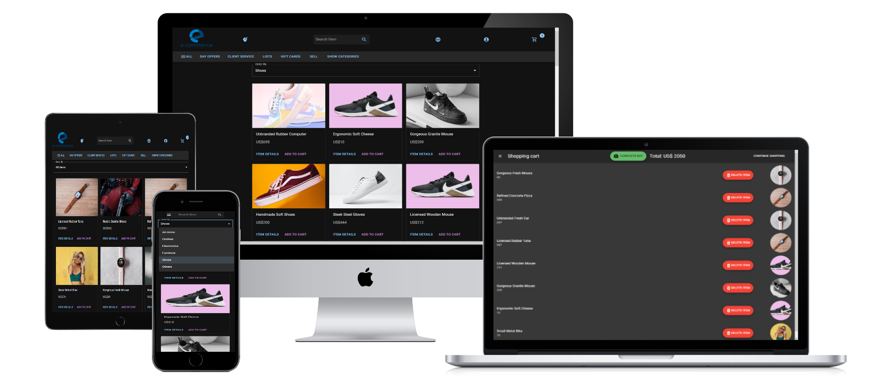
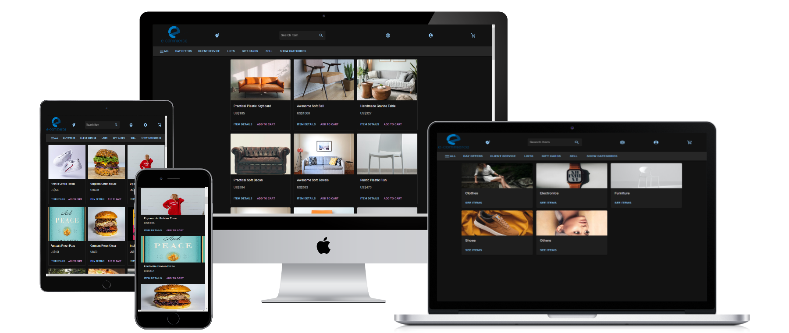

# E-commerce

> Completely responsive E-commerce web page. build with React/Redux and MaterialUI-styled-components. This allows the user to navigate through different categories of items, filter them by category and add them to the shopping cart. Users can manage their current bag on the shopping cart containing a list of items where each one can be deleted. In the shopping cart, the user can delete or finish buying.

_Everyone is welcome to contribute to the project. Once you have a significant contribution, you can add it to your portfolio and show to recruiters your experience._

## Built With

- [React js]()
- [Redux](https://redux.js.org/)
- [Material UI/MUI](https://mui.com)
- [Jest](https://jestjs.io/)
- [React Testing library](https://testing-library.com/docs/react-testing-library/intro/)
- [GitHub CI workflows](https://github.com/wandergithub/e-commerce/actions)
  - Automated deployment
  - Automated testing
  - Automated linters
- [Platzi Fake store API](https://fakeapi.platzi.com/doc/categories#get-all-categories)

- Mobile first design
- Responsive web design

## App screenshot




## Live Demo

[Live Demo Link](https://wandergithub.github.io/e-commerce/)

## Usage 

Be sure to have [Node.js](https://nodejs.org/) installed before proceeding.

```shell
# Clone the repo
git clone https://github.com/wandergithub/e-commerce.git
# Change directory
cd e-commerce
# Install dependencies
npm install
# Start local server
npm start
```

<!-- ### Run tests -->

## Author 👤

[](https://github.com/wandergithub)&nbsp;

[](https://twitter.com/wanderklk1)&nbsp;

[](https://www.linkedin.com/in/wander-gonzalez/)&nbsp;

## 🛠️ Future features

- I'm planning to create a Rails API.
    - So we can allow the users manage their selling accounts.
    - Then users can publish their items.
    - When users complete a buy with a shopping cart, the app put the shopper in contact with all the sellers with an automated whatsapp message.
    - Now people can sell and buy real items.
    - We could add an option to restrict interactions of users by the same contry so deals can be made easily

## 🤝 Contributing

Contributions, issues, and feature requests are welcome!

Feel free to check the [issues page](../../issues/).

### To contribute to this project

1. Go to [issues page](../../issues/).
2. Choose your issue(You can assign yourself), ask questions or suggest improvements.
3. Go to [Kanban Board](https://github.com/users/wandergithub/projects/4/views/1) and update your issue status.
4. Fork the repo, make your changes, and ask for a PR.

### You are welcome to collaborate on this projects too

1. [Budget App](https://github.com/wandergithub/budget-app)

2. [Traveler's Hub](https://github.com/wandergithub/travelers-hub)

3. [Recipe App](https://github.com/wandergithub/Recipe-app)

## Show your support

Give a ⭐️ if you like this project!

## 📝 License

This project is [MIT](./MIT.md) licensed.
